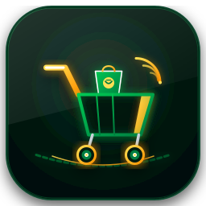
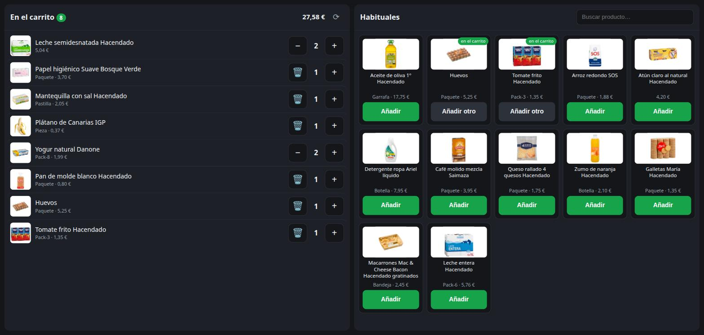

# Mercadona para Home Assistant

<p align="center">
  <picture>
    <source media="(prefers-color-scheme: dark)" srcset="images/logo_dark.png">
    <source media="(prefers-color-scheme: light)" srcset="images/logo_light.png">
    
  </picture>
</p>

<p align="center">
  <a href="https://hacs.xyz"></a>
  <a href="https://github.com/ALArvi019/mercadona-cart-bridge/actions/workflows/validate.yml"></a>
  <a href="LICENSE"></a>
</p>

Integración no oficial que conecta el carrito de la compra de Mercadona con Home
Assistant. Permite añadir productos hablando a un altavoz, verlos como una lista de
tareas más, y gestionarlos desde un panel táctil.

> **Añadir al carrito no compra nada.** El pedido se sigue confirmando a mano desde la
> app o la web de Mercadona. Esta integración no toca ningún endpoint de compra.

<p align="center">
  
</p>

<p align="center"><em>El panel que añade la integración, pensado para una pantalla
táctil. A la izquierda el carrito, a la derecha los productos habituales.</em></p>

## Por qué existe

Mucha gente usa el carrito de la app de Mercadona como lista de la compra. Se va
añadiendo lo que falta durante la semana, y el día del pedido ya está todo dentro. Como
la cuenta se puede compartir, sirve de lista común para toda la casa.

El problema es el momento de añadir. Se te acaba algo, y hay que sacar el móvil,
desbloquearlo, abrir la app, buscar el producto y añadirlo. Se acaba dejando para luego,
y lo que se deja para luego se olvida.

Con esta integración basta con decirlo en alto. Y en una pantalla fija, sea una tablet,
un panel de pared o un móvil viejo colgado, se ve la lista y se añaden los productos de
siempre con un toque.

## Qué hace

* **Añadir por voz.** *"Ok Google, añade papel higiénico a la lista de la compra"* y el
  producto aparece en el carrito. Entiende cantidades, como *"añade 2 mantequillas"*, que
  suma a lo que ya hubiera, y también quitar, como *"quita la mantequilla"*.
* **El carrito como lista de tareas.** Aparece en la tarjeta de listas, en la app del
  móvil y en Assist, sin abrir la app de Mercadona.
* **Panel propio** en la barra lateral, con el carrito a un lado y tus productos
  habituales al otro, con fotos, precios y un botón para añadirlos.
* **Avisa cuando duda**, en lugar de decidir a ciegas.

## Cómo acierta con el producto

Cuando dices "leche" hay decenas de productos que encajan. La regla es sencilla, **gana
lo que ya compras**.

```
1. Alias aprendidos       lo que ya corregiste una vez
2. Tus habituales         la lista que Mercadona mantiene sola
3. Historial de pedidos   lo que has comprado antes
4. Catálogo de tu tienda  cualquier otra cosa
```

Si la elección está reñida, es decir, dos productos casi empatados o poca confianza,
**añade su mejor apuesta y dispara un evento** para que una automatización avise como
cada uno prefiera. Puede ser una notificación al móvil con la foto y el precio, un aviso
en alto por un altavoz, o nada.

Si no encuentra nada con confianza, no inventa. Lo deja sin añadir y avisa.

## La voz pasa por Google Keep

Conviene saberlo antes de instalar. **Un altavoz Google no puede enviar texto libre a
Home Assistant.** El editor de automatizaciones de Google solo admite frases fijas y
acciones sobre dispositivos, y la integración nativa expone entidades, no dictado.

Lo único que hace Google con *"añade papel higiénico a la lista de la compra"* es
escribirlo en una lista de **Google Keep**. Por eso esa lista se usa como **buzón**. La
integración la lee cada pocos segundos, mete el producto en el carrito, y borra la
entrada. Nunca hay que mirar Keep, la lista sigue siendo el carrito.

**Marca varias listas.** Google no deja elegir en cuál escribe: la misma frase acaba en
«Lista de la compra» o en «Mi lista de la compra» según el idioma del altavoz, la cuenta
o la versión de la app. Si vigilas solo una y Google usa la otra, no salta ningún error,
simplemente no aparece nunca nada. En la configuración salen todas las listas de la
cuenta y se pueden marcar las que haga falta.

Hace falta un *master token* de Google, que se obtiene una vez. El razonamiento completo
y los pasos están en [docs/google-keep.md](docs/google-keep.md).

La voz es opcional. Sin ella, el panel, la lista y los servicios funcionan igual, y se
puede añadir desde Assist con el servicio `mercadona.anadir`.

## Instalación

### Con HACS

1. HACS, Integraciones, menú de tres puntos, Repositorios personalizados
2. Añade `https://github.com/ALArvi019/mercadona-cart-bridge` como **Integración**
3. Instala **Mercadona** y reinicia Home Assistant

### A mano

Copia la carpeta `custom_components/mercadona/` a tu `custom_components/` y reinicia.

### Configurar

**Ajustes, Dispositivos y servicios, Añadir integración, Mercadona**

Pedirá un token de sesión. Mercadona **no permite iniciar sesión de forma automática**,
porque su login exige un reCAPTCHA que solo se resuelve en un navegador o en su app. La
integración parte de un `refresh_token` que se extrae una vez y luego renueva sola. La
propia pantalla explica cómo conseguirlo, y en detalle está en
[docs/obtener-token.md](docs/obtener-token.md).

Para activar la voz más adelante, menú de tres puntos, **Reconfigurar**.

## Qué crea

| Entidad | Para qué |
|---|---|
| `todo.<cuenta>_carrito` | El carrito como lista, para ver, añadir y quitar |
| `sensor.<cuenta>_total_del_carrito` | Lo que suma la compra |
| `sensor.<cuenta>_productos_en_el_carrito` | Cuántos hay, con el detalle en atributos |
| `binary_sensor.<cuenta>_sesion_de_mercadona` | Se enciende si la sesión deja de funcionar |

Más un panel **Compra** en la barra lateral.

**Marcar un producto lo quita del carrito**, porque significa que ya no se quiere. Nunca
compra nada.

## Servicios

```yaml
- service: mercadona.anadir
  data:
    producto: "dos paquetes de arroz"   # entiende la cantidad en la frase

- service: mercadona.quitar
  data:
    producto: "mantequilla"

- service: mercadona.vaciar_carrito
```

## Avisos

```yaml
automation:
  - alias: "Compra: revisar lo que ha metido"
    trigger:
      - platform: event
        event_type: mercadona_aviso
    action:
      - service: notify.mobile_app_TU_MOVIL
        data:
          title: "¿Es esto lo que querías?"
          message: >
            Por «{{ trigger.event.data.frase }}» he puesto
            {{ trigger.event.data.producto }}
            ,
            pero había otro casi igual: {{ trigger.event.data.alternativa }}
            
          data:
            image: "{{ trigger.event.data.imagen }}"
```

El evento incluye `tipo`, que puede ser `ambiguo`, `no_encontrado` o `fallo`, además de
`frase`, `producto`, `producto_id`, `imagen`, `precio` y `alternativa`.

## Sin Home Assistant

El repositorio incluye también un **contenedor Docker** equivalente, con su propia web y
una API HTTP, para quien no use Home Assistant. Comparte el mismo núcleo que la
integración. Ver [docs/despliegue.md](docs/despliegue.md).

## Documentación

| Documento | Contenido |
|---|---|
| [obtener-token.md](docs/obtener-token.md) | Conseguir y mantener la sesión de Mercadona |
| [google-keep.md](docs/google-keep.md) | El buzón de voz, y por qué es necesario |
| [integracion-ha.md](docs/integracion-ha.md) | Entidades, servicios y panel |
| [api-mercadona.md](docs/api-mercadona.md) | La API privada de Mercadona, documentada |
| [despliegue.md](docs/despliegue.md) | El contenedor |

## Aviso

Esto usa la **API privada** de Mercadona, que no es pública ni está documentada, y que
puede cambiar o dejar de funcionar sin previo aviso. Este proyecto no está asociado ni
respaldado por Mercadona.

Está pensado para uso doméstico con la cuenta de uno mismo, y al ritmo de una persona
usando la app. Lee el carrito cada dos minutos y el catálogo una vez al día. No conviene
convertirlo en un scraper.

El token de sesión da **acceso completo a la cuenta**. Hay que tratarlo como una
contraseña.

## Licencia

MIT. Ver [LICENSE](LICENSE).
